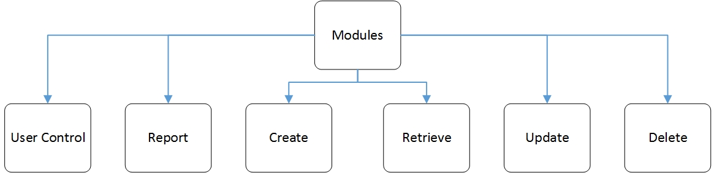
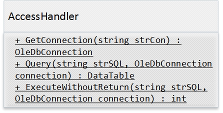

# Magazine

A magazine management software disigned for my Database course. This project only suit for the given Access DataBase file, as it is included in the project floder. If you are interested in software development with *WPF*, *Visual Studio 2015* and *Access*, you may probably find it is a useful reference.

Main features includes:
+   Regular CRUD operations
+   User-base access control
+   Exporting and printing supported by SAP Crystal Reports

## Runtime Requirement

+   Microsoft .NET Framework 4.0
+   Support Pack 20

## Design

1.  Modules:

2.  Classes:

## Acknowledgement

+   SAP Crystal Reports for providing the report module:
[https://wiki.scn.sap.com/wiki/display/BOBJ/Crystal+Reports%2C+Developer+for+Visual+Studio+Downloads](https://wiki.scn.sap.com/wiki/display/BOBJ/Crystal+Reports%2C+Developer+for+Visual+Studio+Downloads)
